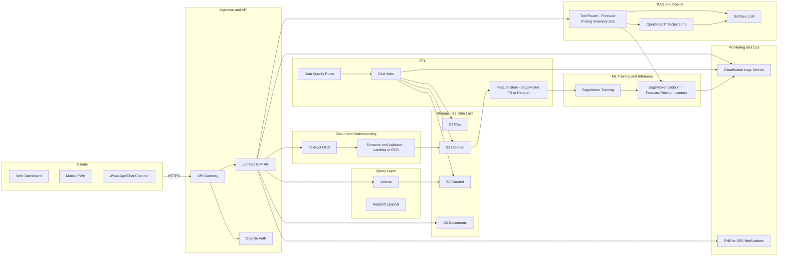
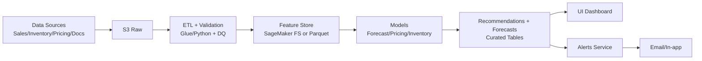
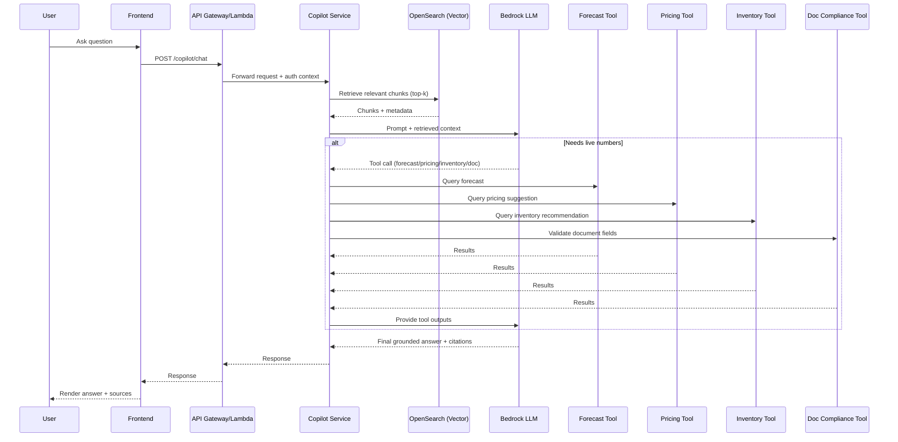

# design.md

## Overview

### What we are building
- **SmartRetail Intelligence Copilot** is an AI-powered decision platform for retailers and marketplace sellers.
- It unifies:
	- **Demand forecasting** (what will sell, when, where)
	- **Pricing intelligence** (optimal price, competitor parity, margin impact)
	- **Inventory optimization** (reorder quantities, safety stock, stockout risk)
	- **Compliance/document understanding** (OCR + extraction + validation)
	- **Copilot** (chat assistant using RAG + tool-calling into platform services)

### Key goals (forecasting + pricing + copilot)
- **Forecasting:** Produce SKU×store×day forecasts with confidence intervals and drivers.
- **Pricing:** Recommend price actions with guardrails and impact simulation.
- **Copilot:** Natural-language interface to analytics, recommendations, and compliance docs with verifiable sources.

### System boundaries
- **Inputs (system owns ingestion & validation):** sales, inventory, product master, competitor prices, promotions/holidays, uploaded documents.
- **Outputs (system owns recommendations & insights):** forecasts, pricing suggestions, reorder plans, compliance results, alerts.
- **Out of scope (for MVP):** automatic PO placement to suppliers, full ERP integrations, real-time POS streaming for all vendors, fraud/chargeback risk scoring.
- **Tenancy:** single-tenant for hackathon demo; multi-tenant ready in production.

## User Roles & User Journeys

### Roles (Seller, Retail Manager, Admin)
- **Seller:** views insights for their catalog, takes actions (price updates, replenishment), uploads invoices/certificates.
- **Retail Manager:** monitors KPIs, reviews recommendations at category/store level, configures thresholds.
- **Admin:** manages users, RBAC, data connectors, audit logs, and environment settings.

### Core journeys (check forecast, change price, upload invoice, chat with copilot)
- **Check forecast**
	- User selects store/category/SKU and horizon.
	- System shows baseline + ML forecast, confidence interval, and driver summary.
	- User exports forecast or creates an alert for stockout risk.
- **Change price**
	- User opens SKU pricing panel.
	- System shows current price, competitor price band, elasticity estimate, recommended price, and impact simulation.
	- User applies change (for demo: generates CSV/API payload); change is audited.
- **Upload invoice/certificate**
	- User uploads PDF/image.
	- System OCRs, extracts key fields, validates rules, returns pass/fail with reasons.
	- User downloads structured output or resolves exceptions.
- **Chat with copilot**
	- User asks a question ("What will stock out next week in Delhi?").
	- Copilot retrieves relevant data + policies, calls tools (forecast/recommendations), returns answer with links to supporting charts and extracted fields.

## High-Level Architecture



### MVP (hackathon demo) vs production
- **MVP:** CSV ingestion + S3, Glue (or Python ETL), Athena queries, basic forecasting endpoint, simplified pricing/inventory heuristics, Textract/Tesseract OCR, Bedrock + OpenSearch RAG.
- **Production:** multi-tenant isolation, event-driven ingestion (Kinesis), managed Feature Store, model registry, canary deployments, full monitoring/drift automation, Redshift for performance, fine-grained RBAC and audit.

## Component Design

### Data Ingestion Service
- **Responsibilities**
	- Accept CSV uploads and/or pull from APIs (marketplace/orders/inventory).
	- Validate schemas, normalize formats, write to S3 Raw.
	- Trigger ETL/validation pipeline.
- **Interfaces**
	- `POST /ingest/sales` (CSV/JSON)
	- `POST /ingest/inventory`
	- `POST /ingest/competitor-prices`
- **MVP implementation**
	- Lambda + S3 presigned upload URLs, schema validation in Lambda.
- **Production considerations**
	- Idempotency keys, deduplication, DLQ, schema evolution with Glue Data Catalog.

### Forecast Service
- **Responsibilities**
	- Train models per category/cluster; generate forecasts per SKU-store-day.
	- Provide confidence intervals and drivers.
	- Support manual overrides (writeback table).
- **Core logic**
	- Baseline: Prophet/SARIMAX; ML: LightGBM/XGBoost using lag features and covariates.
	- Backtesting + model selection by SKU group.
- **MVP**
	- Batch daily training on sample dataset; precompute forecasts and serve via API.
- **Production**
	- Model registry, scheduled retraining, incremental learning, segmentation by store/region.

### Pricing Intelligence Service
- **Responsibilities**
	- Collect competitor prices (API or scrape), compute price position.
	- Estimate elasticity and propose price actions.
	- Guardrails: minimum margin, MAP policy, inventory constraints.
- **MVP**
	- Rule + regression elasticity using historical price/sales; simulate impact.
- **Production**
	- Bayesian elasticity, promotion-aware models, constrained optimization.

### Inventory Optimization Service
- **Responsibilities**
	- Generate reorder recommendations, safety stock, stockout risk.
	- Account for lead time, service level, and demand uncertainty.
- **Core formulas**
	- Demand during lead time: $\mu_L$; uncertainty: $\sigma_L$
	- Safety stock: $SS = z \cdot \sigma_L$
	- Reorder point: $ROP = \mu_L + SS$
	- Order qty: min/max bounded, optionally EOQ.
- **MVP**
	- Daily batch compute for top SKUs.
- **Production**
	- Multi-echelon support, supplier reliability, constraints by warehouse capacity.

### Document Understanding Service (OCR + extraction)
- **Responsibilities**
	- OCR documents, extract structured fields, validate compliance rules.
	- Return confidence and exception list for review.
- **Doc types**
	- Invoices, GST certificates, MSME certs, return/claim forms, policy PDFs.
- **MVP**
	- Textract (or Tesseract) + rule-based extraction templates.
- **Production**
	- Layout-aware extraction (LayoutLM) + active learning, human-in-the-loop review.

### Copilot Service (RAG + tool calling)
- **Responsibilities**
	- Interpret user intent, retrieve relevant context, call platform tools.
	- Produce grounded answers with sources.
- **Tool calling**
	- Tools: `ForecastTool`, `PricingTool`, `InventoryTool`, `DocComplianceTool`, `KPIQueryTool`.
- **MVP**
	- Simple intent routing via prompt + JSON schema.
- **Production**
	- Policy engine, safety filters, prompt versioning, deterministic tool selection.

### Notification Service (alerts)
- **Responsibilities**
	- Create and route alerts from rules and model outputs.
	- Delivery: in-app + email (SNS/SES).
- **Alert types**
	- Stockout risk, demand spike, price anomaly, compliance failure.
- **MVP**
	- Scheduled evaluation (daily/hourly) + SNS.
- **Production**
	- Event-driven alerts, escalation policies, dedupe and suppression windows.

### Admin Service
- **Responsibilities**
	- RBAC management, connectors, thresholds, tenant configs.
	- Audit logs, override approvals, API keys.
- **MVP**
	- Minimal UI + endpoints.
- **Production**
	- Multi-tenant admin console, SCIM provisioning, policy-as-code.

## Data Flow & Pipelines

### Batch pipeline (daily/hourly)
- **Daily (T+1)**
	- Ingest sales/inventory/price → validate → clean → feature engineering → forecast & recommendations → persist curated outputs.
- **Hourly (optional for MVP)**
	- Update competitor prices and compute pricing alerts.

### Real-time pipeline (optional)
- Use Kinesis (or SQS + Lambda) for streaming events (orders, inventory updates).
- Maintain near real-time stockout risk and anomaly alerts.

### Data validation + cleaning rules
- Enforce schema and types at ingestion; reject or quarantine malformed records.
- Deduplicate by `(date, sku_id, store_id, source_event_id)`.
- Handle missing values:
	- `price`: forward-fill within SKU-store, mark `imputed_price=true`.
	- `inventory_on_hand`: do not impute; mark as `unknown` and exclude from reorder.
- Outliers:
	- Winsorize units at 99th percentile per SKU unless `promo_flag=true`.
- Normalize:
	- Dates to ISO-8601; currency to base currency; strings trimmed and uppercased for IDs.



## AI/ML System Design

### Forecasting model approach (Prophet/LSTM/LightGBM)
- **Baseline (fast, interpretable):** Prophet or SARIMAX per SKU cluster.
- **Primary (MVP+):** LightGBM/XGBoost regression with engineered time-series features:
	- Lags: `units_sold_lag_1/7/14/28`
	- Rolling stats: `rolling_mean_7/28`, `rolling_std_28`
	- Calendar: weekday, month, holiday
	- Price & promo: current price, discount %, promo flag
	- Inventory signals: stockouts (censoring) flags
- **Advanced (production):** LSTM/Temporal Fusion Transformer for high-volume SKUs; hierarchical reconciliation (store→region→national).
- **Evaluation:** rolling-origin backtesting; metrics: MAPE, WAPE; segment by category.

### Pricing approach (competitor scraping + elasticity + rule guardrails)
- **Competitor collection:** API where available; else controlled scraping (respect robots/TOS) with caching.
- **Elasticity:** log-log regression or gradient boosting with price as feature; compute elasticity bounds.
- **Recommendation:** constrained optimization:
	- Objective: maximize margin or revenue
	- Constraints: min margin %, max price change %, MAP/policy, inventory level, competitor band.
- **Guardrails (testable):**
	- Never recommend below `min_margin_pct`.
	- Never change price by > `max_delta_pct` per day.
	- If inventory < safety stock, avoid price decreases.

### Anomaly detection (returns, sudden sales spikes, fraud patterns)
- **MVP:** statistical rules + z-score on residuals (actual - forecast).
- **Production:** isolation forest or seasonal hybrid ESD for spikes/drops.
- **Signals:** sudden unit spikes without promo, return-rate spikes, repeated claims, inventory negative.

### Recommendation engine logic (reorder quantity + pricing action)
- **Reorder** based on forecast demand, lead time, service level, and on-hand/in-transit.
- **Pricing** based on elasticity + competitor parity + inventory posture.
- **Action ranking**
	- Compute action score: `impact_margin + impact_service_level - risk_penalty`.
	- Show top actions per store/category.

### Explainability strategy
- **Forecast:** feature importance (SHAP for LightGBM) + textual summary.
- **Pricing:** show competitor band, elasticity estimate range, constraint triggers.
- **Inventory:** show ROP components (lead-time demand + safety stock) and current position.
- **UI requirement:** every recommendation must display “Why?” and “What if?” simulation.

### Model monitoring + drift handling
- **Metrics**
	- Forecast: MAPE/WAPE weekly, bias by category.
	- Pricing: realized uplift vs control period, guardrail violations.
	- Inventory: stockout rate and overstock days.
- **Drift**
	- Feature drift: PSI/KS on key features (price, units, promo share).
	- Trigger retrain if PSI > 0.2 or MAPE worsens > 10% for 2 windows.
- **Operational**
	- Store model versions, data snapshots, and evaluation reports.

## RAG + Copilot Design

### What documents are indexed (policies, invoices, GST, SOPs)
- Marketplace policies (listing rules, returns, prohibited items, invoice rules).
- Internal SOPs (replenishment, pricing approvals, compliance checks).
- Compliance references (GST guidelines, format rules).
- Processed invoice text + extracted fields (for user-owned docs).

### Chunking + embeddings strategy
- **Chunking**
	- Policy/SOP: semantic chunks of ~300–600 tokens with overlap 50–100 tokens.
	- Invoices: store both full OCR text and structured key-value pairs; chunk by sections (seller/buyer, totals, tax lines).
- **Embeddings**
	- Use Bedrock embeddings model.
	- Store vectors + metadata in OpenSearch:
		- `doc_type`, `tenant_id`, `sku_id` (optional), `upload_date`, `confidence`.

### Retrieval process
- Hybrid retrieval:
	- Vector similarity (top-k)
	- Keyword filters by doc_type + tenant_id
	- Optional reranker (production)
- Return citations: chunk IDs + source document names.

### Prompting approach
- System prompt enforces:
	- Use tools for numeric answers.
	- Cite sources for policy/compliance.
	- Ask clarifying question if missing filters (store, date range) when needed.
- Tool schema:
	- Structured JSON function calls with strict validation.

### Safety guardrails (avoid hallucination, show sources)
- Refuse to answer if sources are missing for compliance/policy claims.
- For computed insights, always attach query parameters and timestamp.
- PII redaction rules applied before LLM context.



## Database / Storage Design

### Storage layers: raw → cleaned → curated
- **Raw (S3):** exact ingested files/events (immutable).
- **Cleaned (S3):** standardized schema, validated, deduped.
- **Curated (S3/Redshift optional):** analytics-ready and ML-ready tables.

### Sample schemas/tables

#### sales_transactions
- `date` (DATE)
- `sku_id` (STRING)
- `store_id` (STRING)
- `units_sold` (INT)
- `revenue` (DECIMAL)
- `price` (DECIMAL)
- `promo_flag` (BOOLEAN)
- `source` (STRING)

#### inventory_snapshots
- `date` (DATE)
- `sku_id` (STRING)
- `store_id` (STRING)
- `on_hand` (INT)
- `in_transit` (INT)
- `backorder` (INT)
- `lead_time_days` (INT)

#### product_master
- `sku_id` (STRING)
- `category` (STRING)
- `brand` (STRING)
- `pack_size` (STRING)
- `mrp` (DECIMAL)
- `min_margin_pct` (DECIMAL)

#### competitor_prices
- `date` (DATE)
- `sku_id` (STRING)
- `competitor` (STRING)
- `competitor_price` (DECIMAL)
- `url` (STRING)
- `confidence` (DECIMAL)

#### recommendations
- `run_date` (DATE)
- `sku_id` (STRING)
- `store_id` (STRING)
- `rec_type` (ENUM: price|reorder|alert)
- `payload_json` (STRING)
- `score` (DECIMAL)
- `status` (ENUM: proposed|accepted|rejected|expired)
- `explanation` (STRING)

#### documents_metadata
- `doc_id` (STRING)
- `tenant_id` (STRING)
- `doc_type` (STRING)
- `s3_uri` (STRING)
- `upload_ts` (TIMESTAMP)
- `extracted_json` (STRING)
- `validation_status` (ENUM: pass|fail|needs_review)
- `confidence` (DECIMAL)

#### chat_logs
- `conversation_id` (STRING)
- `tenant_id` (STRING)
- `user_id` (STRING)
- `ts` (TIMESTAMP)
- `role` (ENUM: user|assistant|tool)
- `message` (STRING)
- `citations_json` (STRING)

### Partition keys
- S3/Athena partitions:
	- `date` for fact tables.
	- `state/region`, `store_id`, `category` (optional) for query acceleration.
	- Documents partition by `upload_date` and `tenant_id`.

## API Design

### Conventions
- Auth: JWT via Cognito.
- Content: `application/json` (uploads via presigned S3).
- Idempotency: `Idempotency-Key` header for ingestion and document uploads.

### Endpoints

#### POST /forecast
**Request**
```json
{
	"store_id": "DELHI_01",
	"sku_ids": ["SKU_123", "SKU_456"],
	"horizon_days": 14,
	"granularity": "day"
}
```
**Response**
```json
{
	"generated_at": "2026-01-22T10:00:00Z",
	"forecasts": [
		{
			"sku_id": "SKU_123",
			"store_id": "DELHI_01",
			"series": [
				{"date": "2026-01-23", "yhat": 120, "yhat_lower": 95, "yhat_upper": 150}
			],
			"drivers": [
				{"feature": "promo_flag", "impact": "high"},
				{"feature": "price", "impact": "medium"}
			]
		}
	]
}
```

#### POST /recommendations
**Request**
```json
{
	"store_id": "DELHI_01",
	"category": "GROCERY",
	"as_of_date": "2026-01-22"
}
```
**Response**
```json
{
	"as_of_date": "2026-01-22",
	"recommendations": [
		{
			"rec_type": "reorder",
			"sku_id": "SKU_123",
			"store_id": "DELHI_01",
			"reorder_qty": 500,
			"risk": "stockout_7d",
			"explanation": "Forecasted demand exceeds on-hand during lead time; service level 95%."
		}
	]
}
```

#### POST /pricing-suggest
**Request**
```json
{
	"sku_id": "SKU_123",
	"store_id": "DELHI_01",
	"current_price": 199.0,
	"objective": "maximize_margin"
}
```
**Response**
```json
{
	"sku_id": "SKU_123",
	"store_id": "DELHI_01",
	"recommended_price": 209.0,
	"expected_margin_uplift_pct": 1.8,
	"guardrails": {"min_margin_pct": 10, "max_delta_pct": 8},
	"evidence": {"competitor_band": [205, 215], "elasticity": -1.2}
}
```

#### POST /upload-document
**Request** (presigned flow)
```json
{
	"doc_type": "invoice",
	"file_name": "invoice_001.pdf"
}
```
**Response**
```json
{
	"doc_id": "DOC_abc123",
	"upload_url": "https://s3-presigned-url...",
	"expires_in_seconds": 900
}
```

#### POST /copilot/chat
**Request**
```json
{
	"conversation_id": "CONV_001",
	"message": "Which SKUs are likely to stock out next week in Delhi?",
	"context": {"store_id": "DELHI_01", "horizon_days": 7}
}
```
**Response**
```json
{
	"conversation_id": "CONV_001",
	"answer": "Top stockout risks next week: SKU_123, SKU_456. Recommended reorder quantities are 500 and 220 respectively.",
	"citations": [
		{"source": "recommendations", "ref": "run_date=2026-01-22"}
	],
	"tool_calls": ["InventoryTool", "ForecastTool"]
}
```

#### GET /alerts
**Response**
```json
{
	"alerts": [
		{
			"alert_id": "AL_001",
			"type": "stockout_risk",
			"severity": "high",
			"sku_id": "SKU_123",
			"store_id": "DELHI_01",
			"created_at": "2026-01-22T09:00:00Z",
			"status": "open"
		}
	]
}
```

## UI/UX Design (MVP)

### Dashboard layout
- KPI tiles: Revenue, Margin, Forecast Accuracy (MAPE), Stockout Rate, Inventory Turns.
- Filters: Date range, Store, Category, SKU.
- Widgets:
	- “Top actions today” (reorder + pricing)
	- “Alerts” panel
	- “Forecast vs actual” chart

### Forecast page
- SKU/store selector + horizon.
- Line chart: actual vs forecast + confidence band.
- Driver panel: top contributing factors.
- Export forecast: CSV/JSON.

### Pricing page
- Current price, competitor range, recommended price.
- Impact simulator (revenue/margin).
- Guardrail indicators (pass/fail) with reasons.

### Copilot chat UI
- Chat panel with suggested prompts.
- “Sources” drawer showing citations.
- “Run tool” badges for transparency (forecast/pricing/inventory/doc).

### Alerts section
- Table of alerts with severity, SKU, store, reason, recommended action.
- Actions: acknowledge, resolve, snooze.

## Security & Privacy

### RBAC roles
- **Seller:** read recommendations/forecasts/pricing for allowed SKUs; upload documents.
- **Retail Manager:** all seller permissions + threshold configuration and approvals.
- **Admin:** user management, connectors, audit access, tenant settings.

### Encryption at rest/in transit
- TLS 1.2+ for all client/API traffic.
- S3 SSE-KMS; RDS encryption with KMS.

### Audit logs
- Log: authentication events, data uploads, overrides, recommendation accept/reject, admin changes.
- Store in append-only storage (S3 + Object Lock for production).

### PII handling + retention
- Redact PII in logs and LLM context (names, addresses, phone, email where applicable).
- Retention policy:
	- Chat logs: 30–90 days (configurable).
	- Documents: per tenant policy; deletion supported.

### Compliance readiness
- Designed to support SOC2-style controls (auditability, least privilege, encryption).
- Document validation rules versioned (policy-as-code).

## Scalability & Reliability

### Scaling strategy
- Stateless APIs scale via Lambda concurrency or ECS autoscaling.
- Batch workloads scale via Glue/SageMaker managed jobs.
- Partitioned data lake for query performance.

### Caching
- Cache common KPI queries and latest recommendations (Redis/ElastiCache in production).
- Cache competitor price fetches with TTL to limit scraping/API calls.

### Async queues
- Use SQS for long-running tasks:
	- OCR jobs
	- Forecast batch generation
	- Alert evaluation

### Rate limiting
- API Gateway throttling by tenant/user.
- Copilot endpoints stricter rate limits (LLM cost control).

### Fallback rules when ML fails
- Forecast fallback: seasonal naive or Prophet baseline.
- Pricing fallback: competitor parity + fixed margin rule.
- Inventory fallback: reorder based on last 7/28 day moving average.
- Copilot fallback: ask clarifying questions; refuse if no sources.

## Observability

### Metrics (latency, accuracy, drift)
- **API:** p50/p95 latency, error rate, request volume.
- **ML:** forecast MAPE/WAPE weekly; recommendation acceptance rate; pricing uplift.
- **Drift:** PSI for key features; alert if PSI > 0.2.
- **OCR:** extraction confidence distribution; validation fail rate.

### Logs, tracing
- Structured JSON logs with correlation IDs.
- Distributed tracing (X-Ray in production).

### Alert thresholds
- API error rate > 2% for 10 minutes.
- Copilot latency p95 > 8s.
- Forecast MAPE increase > 10% vs previous week.
- OCR failure rate > 5% in 1 hour.

## Trade-offs & Decisions

### Why chosen approach
- Data lake + batch-first design fits hackathon constraints and common retail workflows.
- LightGBM provides strong accuracy with fast training and explainability.
- RAG + tool-calling ensures copilot answers are grounded and numerically correct.

### Alternatives considered
- **Full real-time streaming** (Kinesis everywhere): higher complexity; deferred to production.
- **Deep learning-only forecasting**: higher accuracy possible but slower iteration; keep as future enhancement.
- **Single monolith service**: faster initially but harder to scale; MVP may be modular monolith, production splits services.

## Deployment Plan

### MVP deployment steps
- Provision AWS resources (S3 buckets, API Gateway, Lambda, OpenSearch, Bedrock access).
- Deploy backend:
	- Ingestion + APIs (Lambda)
	- Batch jobs (Glue or containerized ETL)
	- Simple model artifacts in S3
- Deploy frontend (static hosting via S3 + CloudFront) and configure Cognito.
- Run initial data load and generate first recommendations.

### CI/CD pipeline overview
- GitHub Actions:
	- Lint + unit tests
	- Build frontend
	- Package Lambda functions
	- Deploy via IaC (CDK/Terraform) to dev environment
- Model pipeline:
	- Training job triggered manually or scheduled; artifacts versioned in S3.

### Environment configs
- `.env` / Parameter Store values:
	- `COGNITO_POOL_ID`, `S3_BUCKET_RAW`, `S3_BUCKET_CURATED`
	- `OPENSEARCH_ENDPOINT`, `BEDROCK_MODEL_ID`
	- `ALERT_EMAIL_FROM`, `ALERT_EMAIL_TO`
	- `TENANT_MODE` (single-tenant for MVP)

## Future Enhancements
- **Multilingual copilot** (Hindi + regional languages) with localized UI.
- **Auto procurement**: generate POs and send to suppliers with approval workflow.
- **Supplier negotiation AI**: suggest negotiation levers based on lead time and SLA performance.
- **Dynamic pricing automation**: closed-loop price experimentation with guardrails and A/B testing.
